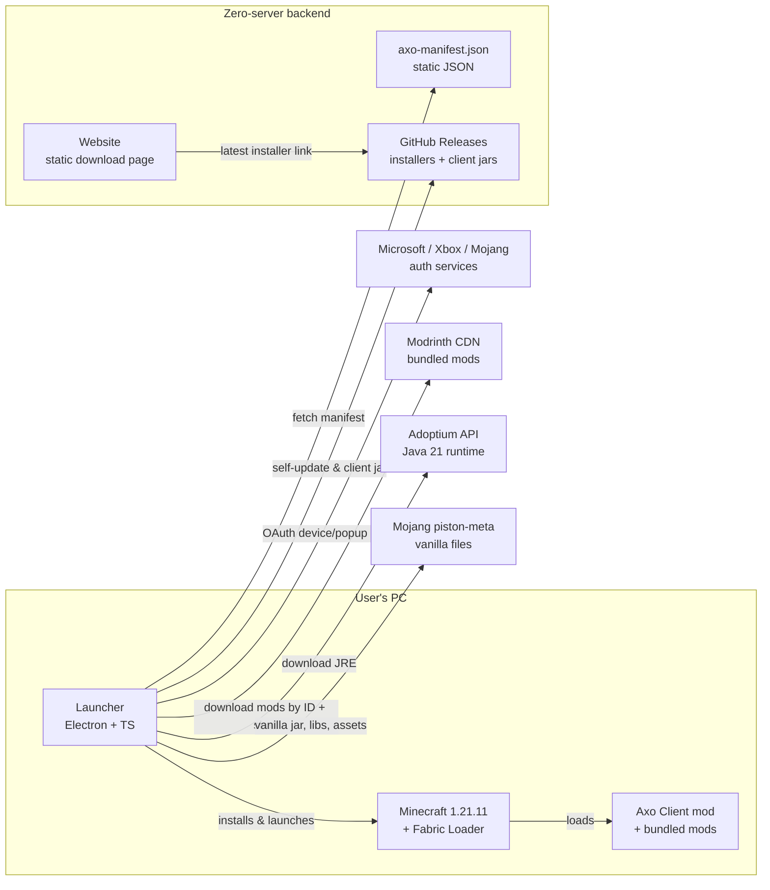

# Axo Client — Architecture

Three connected but separate systems, joined by one data contract (the version manifest) and one distribution channel (GitHub Releases).

## System overview



**Key property:** there is no server we operate. The website is static, the manifest is static JSON deployed with it, and all binaries live in GitHub Releases or third-party CDNs. A real API can be introduced later behind the same URLs without breaking old launchers.

## The data contract: `axo-manifest.json`

The manifest (spec: [`manifest-spec.md`](manifest-spec.md), instance: [`../manifest/axo-manifest.json`](../manifest/axo-manifest.json)) is the single source of truth for *what a playable Axo installation is*:

- channels (`stable`, `beta`) → list of supported versions
- per version: Minecraft version, Fabric Loader version, Axo client mod artifact (URL + sha1), bundled mods (Modrinth project/version IDs + sha1), required Java major version
- launcher minimum version (forces self-update before install if too old)

The launcher hardcodes **no** Minecraft knowledge. Supporting a new Minecraft version = port the client mod + add one manifest entry. This is the mechanism that lets Axo scale from one version to all versions without a launcher rewrite.

Bundled mods are **downloaded from Modrinth at install time, never redistributed in our binaries**. This keeps us clean with mod licenses (see [`risks.md`](risks.md) R2).

## Client mod (`client/`)

Java 21, Fabric Loom, Mojang official mappings. Package root `dev.axoclient`.

```
dev.axoclient
├── AxoClient            client entrypoint: registers every module, one place
├── core/
│   ├── AxoModule        base class: id, name, category, onEnable/onDisable/onTick, settings()
│   ├── ModuleManager    registry, tick dispatch, enable/disable, HUD dispatch
│   ├── ModuleSetting    one adjustable integer, rendered as -/+ in the ClickGUI
│   ├── HudRenderable    opt-in interface for modules that draw
│   ├── ModuleCategory   PVP / PERFORMANCE / QOL / COSMETIC / HUD
│   └── AxoConfig        versioned JSON config (Gson), per-module sections, atomic save
├── hud/                 HudModule base (single-line text), HudAnchor, HudPosition
├── modules/
│   ├── hud/             ~24 readouts: FPS, coords, health, armour, compass, biome, …
│   ├── pvp/             keystrokes, target HUD, attack cooldown, damage numbers, combo
│   ├── qol/             fullbright, zoom, toggle sprint, copy coords, chat tools
│   └── cosmetic/        10 capes + custom cape from PNG, 20 particle trails, colour trail
├── gui/                 ClickGuiScreen, HudEditorScreen, themes, notifications, GuiRender
├── chat/                ChatTweaks — the logic behind the chat mixin, kept testable
├── input/ util/ update/ keybinds, key polling, in-game update check
├── mixin/               required mixins — a failure here stops the game booting
└── mixin/optional/      optional mixins — a failure here only breaks one feature
```

Design rules:

1. **Everything user-facing is a module.** One class per feature, registered in `AxoClient.onInitializeClient()`, config section auto-derived from module id. Adding a feature never touches core.
2. **Prefer polling over mixins, and never let a nice-to-have be fatal.** Two mixin configs: `axoclient.mixins.json` is `required: true` and holds only what the client cannot work without; `axoclient.optional.mixins.json` is `required: false` for everything else. Most features avoid mixins entirely by diffing state on the client tick.
3. **`onEnable()` runs after the client is up, not at registration.** Registration happens during mod init, before `Minecraft.options` exists — calling `onEnable()` there NPEs and takes the game down on boot (this happened; see P5-02). `ModuleManager.enableInitial()` is fired from `CLIENT_STARTED` instead.
4. **Performance comes from bundled mods** (Sodium, Lithium via the manifest), not reimplementation. Axo modules are PvP/QoL/HUD features.
5. **Server-fairness line:** no modules that give unfair advantage (no reach, no aim, no auto-clicker). Balanced-PvP means info and rendering QoL, the same line Lunar/Badlion draw. This keeps Axo allowed on major servers.
6. **Cosmetics are local-only.** Capes and trails render on your own screen. Showing them to other players needs a server hosting the textures, which Axo deliberately does not have.

## Launcher (`launcher/`)

Electron + TypeScript. Main process owns all privileged work; renderer is a React UI talking over a typed IPC bridge.

```
launcher/src
├── main/
│   ├── index.ts        window lifecycle, IPC wiring
│   ├── manifest.ts     fetch + validate axo-manifest.json, offline cache
│   ├── fallbackManifest.ts  bundled last-resort manifest
│   ├── auth.ts         Microsoft login (msmc), token refresh
│   ├── accountStore.ts multi-account persistence (accounts.dat, safeStorage)
│   ├── tokens.ts       safeStorage encrypt/decrypt
│   ├── java.ts         Adoptium JRE provisioning
│   ├── install.ts      vanilla + Fabric + mods into %APPDATA%/.axoclient
│   ├── download.ts     hash-verified downloads with progress
│   ├── sync.ts         mods-folder reconciliation (keep/replace/remove)
│   ├── fabricProfile.ts / versions.ts / semver.ts / paths.ts / progress.ts
│   ├── launch.ts       game launch via minecraft-launcher-core, quickPlay join
│   ├── settings.ts     persisted settings, atomic writes
│   ├── profiles.ts     named launch profiles
│   ├── servers.ts      saved servers for quick join
│   ├── system.ts       RAM recommendation, JVM presets
│   ├── skin.ts / skinLibrary.ts   skin read/apply + saved skin library
│   ├── userMods.ts     player-owned mods (protected from sync removal)
│   ├── screenshots.ts  screenshot listing/read/delete (traversal-guarded)
│   ├── news.ts         GitHub Releases → news items
│   ├── crashReport.ts  read the game's crash report, diagnose in plain English
│   ├── discord.ts      Rich Presence over Discord's local IPC (no native dep)
│   ├── logger.ts       launcher + game logs, crash reports
│   └── updater.ts      electron-updater against GitHub Releases
├── preload/            contextBridge: the only surface renderer can call
│   ├── index.ts        the bridge itself
│   └── index.d.ts      its types — must be edited in lockstep with index.ts
└── renderer/           React app (screens below), light-blue-on-black theme
```

Modules that import `electron` or `msmc` cannot be unit-tested, so privileged
work is kept in `index.ts` and the logic beneath it stays pure. That is why
`accountStore`, `profiles`, `servers`, `crashReport`, `system`, `sync`,
`userMods`, `skinLibrary` and `screenshots` are separate files: each is
directly testable, and together they carry most of the launcher's real logic.

### Launcher screens

| Screen | Purpose |
|---|---|
| **Login** | Microsoft sign-in (msmc), progress + errors |
| **Play** | account switcher, version picker, big LAUNCH, install/launch progress, quick-join with saved servers, crash card, news |
| **Skins** | current skin in 3D, upload a new one, saved skin library |
| **Mods** | add/enable/disable/remove your own mods per version |
| **Screenshots** | browse, view, copy to clipboard, reveal, delete |
| **Versions** | per-version install state, install, repair, delete |
| **Settings** | RAM (with a recommendation), speed presets, JVM args, profiles, Discord toggle, repair, log viewer, playtime |

### IPC boundary rule

Only `SessionInfo` (username + uuid) crosses to the renderer. `accessToken`
and the mclc auth object stay in the main process, on `AxoSession`. Anything
needing the token — applying a skin, launching — is done main-side and returns
a result, never the token.

### Launch pipeline (happy path)

1. Fetch + validate manifest (cache for offline).
2. Ensure logged in: load encrypted refresh token → msmc refresh → Minecraft profile. Else show Login.
3. Ensure Java: manifest says `javaMajor: 21` → check cache → else download Temurin JRE from Adoptium API.
4. Ensure game files: minecraft-launcher-core resolves vanilla 1.21.11 (piston-meta) + Fabric loader profile; mods folder synced to manifest list (download by sha1, delete strays).
5. Launch child process with auth session; stream logs; detect crash exit codes.

Every step is idempotent and hash-verified, so "repair install" is just re-running the pipeline.

## Website (`website/`)

Static, single page for now (download-only scope): hero + Windows download button + three feature blurbs. The button resolves the latest installer via the public GitHub Releases API client-side, with a hardcoded fallback link. Deployed on Cloudflare Pages or GitHub Pages (task P4-04); the manifest JSON deploys alongside it under `/manifest/axo-manifest.json` so the launcher fetches from the website domain, not raw.githubusercontent.com (URL stability = we can move hosting later without breaking launchers).

Pages planned later (not built now): changelog, FAQ, privacy policy (needed once analytics/crash reporting exist — task P5-08).

## Services we depend on (all third-party, all free-tier)

| Service | Used for | Failure mode handled by |
|---|---|---|
| GitHub Releases | launcher installers, client mod jars, self-update feed | manifest can point anywhere; URLs are absolute |
| Cloudflare/GitHub Pages | website + manifest hosting | launcher's offline manifest cache |
| Microsoft/Xbox/Mojang auth | login | clear error surface; cached session until expiry |
| Modrinth CDN | bundled mod downloads | sha1-pinned versions; retry; mirror URL field in manifest |
| Adoptium API | Java 21 runtimes | cached JRE; manual Java path override in Settings |
| Mojang piston-meta | vanilla jars/assets/libraries | handled inside minecraft-launcher-core |

## Tech stack summary

| Piece | Choice | Why (short) |
|---|---|---|
| Client mod | Java 21 + Fabric Loom, Mojang mappings | Fabric requirement; mojmap avoids yarn-build pinning |
| Launcher shell | Electron + electron-vite + React + TS | chosen for UI polish and iteration speed |
| MS auth | [msmc](https://github.com/Hansson01/MSMC) | maintained Node MSA→MC flow incl. Electron popup |
| Game launch | [minecraft-launcher-core](https://github.com/Pierce01/MinecraftLauncher-core) | handles piston-meta, assets, libraries, forge/fabric profiles |
| Packaging | electron-builder (NSIS) | standard Windows installer + updater feed |
| Self-update | electron-updater + GitHub Releases | zero-server update channel |
| Validation | zod (manifest), Gson (client config) | schema errors fail loud and early |
| Website | plain HTML/CSS/JS | one page; frameworks add nothing yet |

Reference docs: [Fabric — getting started](https://docs.fabricmc.net/develop/getting-started/launching-the-game) · [Fabric 1.21.11 docs](https://docs.fabricmc.net/1.21.11/) · [Microsoft auth scheme](https://minecraft.wiki/w/Microsoft_authentication) · [MinecraftAuth (Java reference impl)](https://github.com/RaphiMC/MinecraftAuth) · [OpenLauncherLib](https://github.com/Litarvan/OpenLauncherLib)
